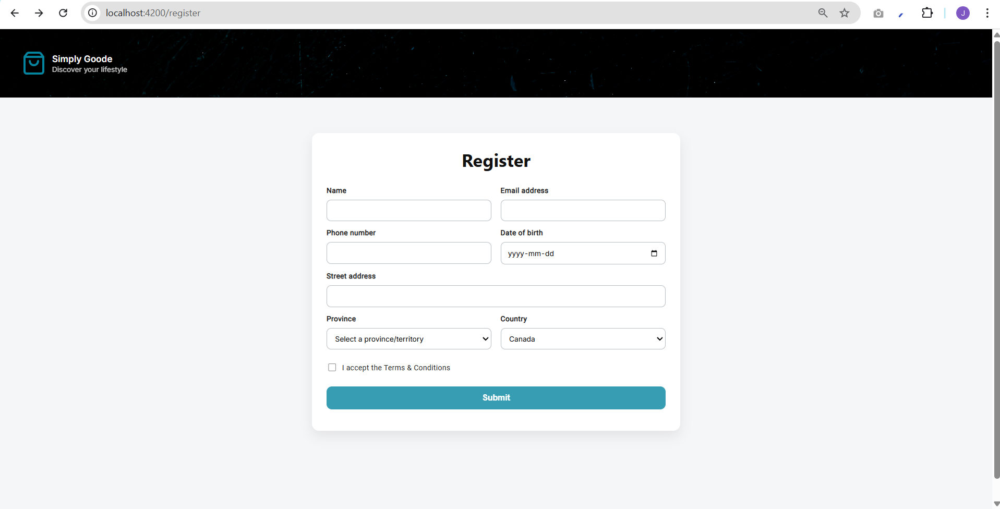
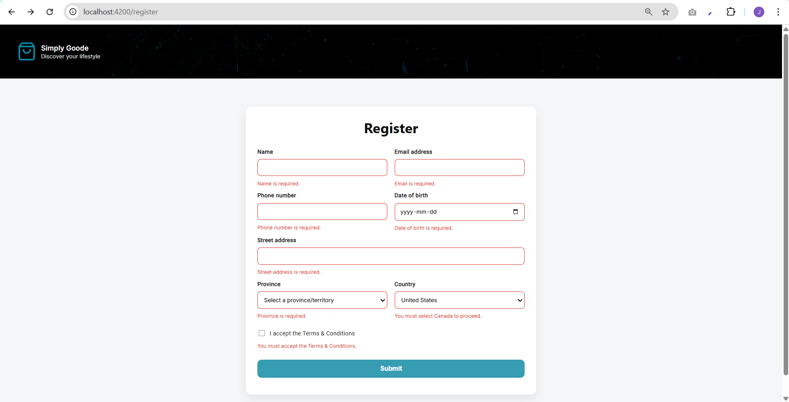
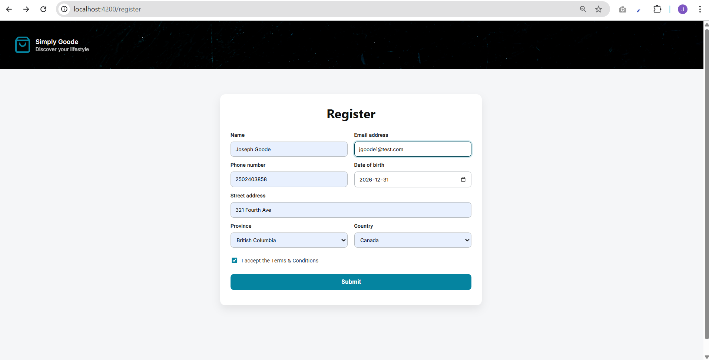

# Everyday Market App – Angular Front-End Frameworks  
**Author: Joe Goode**

This repository contains the **Everyday Market App**, developed using **modern Angular (v17+ standalone components)**.

This version was completed on a **separate branch extending Assignment 1** and focuses on routing and reactive form validation using Angular 17+ features.

---

## Project Overview

The Everyday Market App is a multi-page Angular application featuring:

- A registration form with full client-side validation
- A products page
- Angular Router navigation between views

This assignment builds directly on the previous version and demonstrates modern Angular practices including standalone components, reactive forms, and custom validators.

---

## Branch Information

This assignment was developed on a new branch of the original Everyday Market App project.

The original Assignment 1 functionality (Header, Products page, category components) remains intact.

This branch adds:

- Routing configuration
- Register page component
- Reactive form implementation
- Custom validation logic
- Form styling improvements
- Router navigation on successful submission

---

## Features Implemented

### Angular Routing

Routes configured in `app.routes.ts`:

- `/register` → RegisterPageComponent
- `/products` → ProductsPageComponent
- `/` redirects to `/register`

Router is injected into the Register component and used to navigate programmatically after successful form submission.

---

### Register Page – Reactive Form

The RegisterPageComponent uses Angular’s ReactiveFormsModule.

Fields implemented with validation:

- Name  
  - Required  
  - Minimum 5 characters  
  - Letters and spaces only (pattern validator)

- Email  
  - Required  
  - Valid email format

- Phone  
  - Required  
  - 10 digit number pattern

- Date of Birth  
  - Required  
  - HTML date input (yyyy-mm-dd)

- Street Address  
  - Required  
  - Letters, numbers, and spaces only

- Province  
  - Dropdown of Canadian provinces and territories  
  - Required

- Country  
  - Dropdown (Canada, United States)  
  - Must select Canada to proceed (custom validator)

- Accept Terms  
  - RequiredTrue validator

Submit button is disabled until the form is valid and Canada is selected.

---

### Custom Validators

A reusable custom validator was created for enforcing Canada-only selection.

Validator file:

`src/app/validators/register-validators.ts`

This demonstrates:

- Creating custom ValidatorFn
- Applying reusable validators
- Integrating custom errors into template validation messages

---

### Visual Validation Feedback

Fields that are both:

- touched  
- invalid  

Display:

- Red border
- Error message below input

This uses Angular 17+ control flow syntax (`@if`) for clean conditional rendering.

---

### Modern UI Styling

The register form was redesigned to resemble a modern card-style layout.

Styling includes:

- Responsive grid layout
- Two-column layout on larger screens
- Soft box-shadow card container
- Rounded inputs
- Focus states with brand colour highlight
- Hover states on inputs
- Styled checkbox using accent-color
- Styled disabled and hover states for button

Responsive behavior implemented with media queries.

---

## Angular Concepts Demonstrated

- Standalone components
- Angular Router configuration
- Programmatic navigation using Router
- ReactiveFormsModule
- Built-in validators
- Custom validators
- Form state validation
- Angular 17+ control flow (`@if`, `@for`)
- Component organization by feature
- Responsive layout with CSS Grid

---

## Screenshots

### Form on Load

### Validation Errors (Fields Missing)

### Completed Form

### Responsive Layout

---

## Technologies Used

- Angular 17+ (Standalone Components)
- TypeScript
- HTML5
- CSS3
- ESLint

---

## Testing and Linting

The project was tested using:

- `ng serve`
- Manual browser testing of:
  - Validation messages
  - Disabled submit behavior
  - Successful navigation to /products

ESLint was installed and configured.

`ng lint` was run to verify code quality.

A failing test in `app.spec.ts` was corrected by updating the test to reflect the current standalone AppComponent structure.