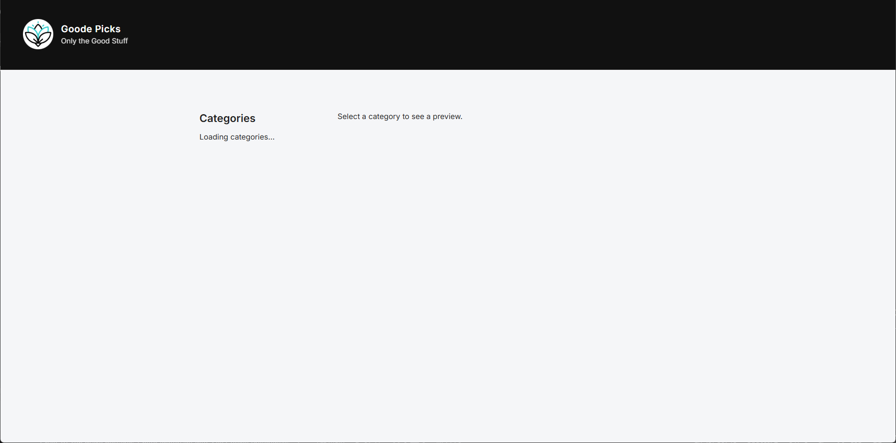
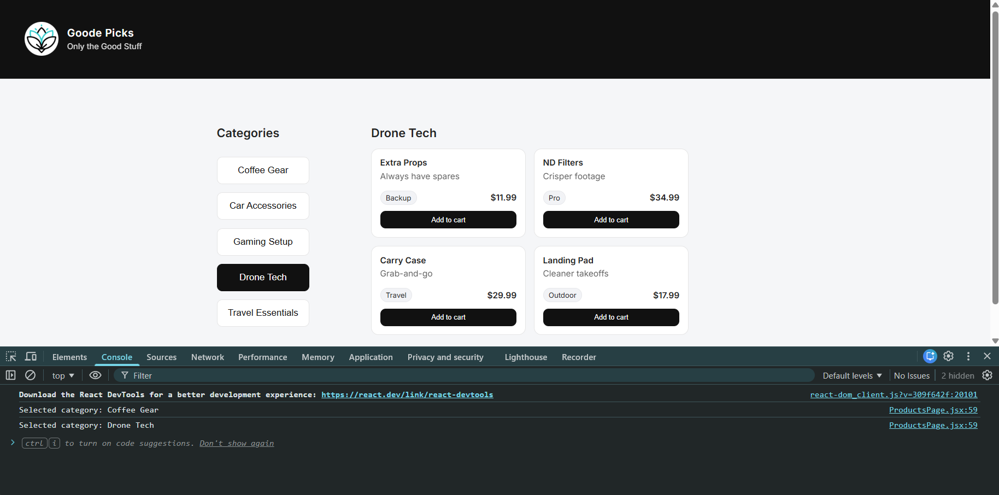
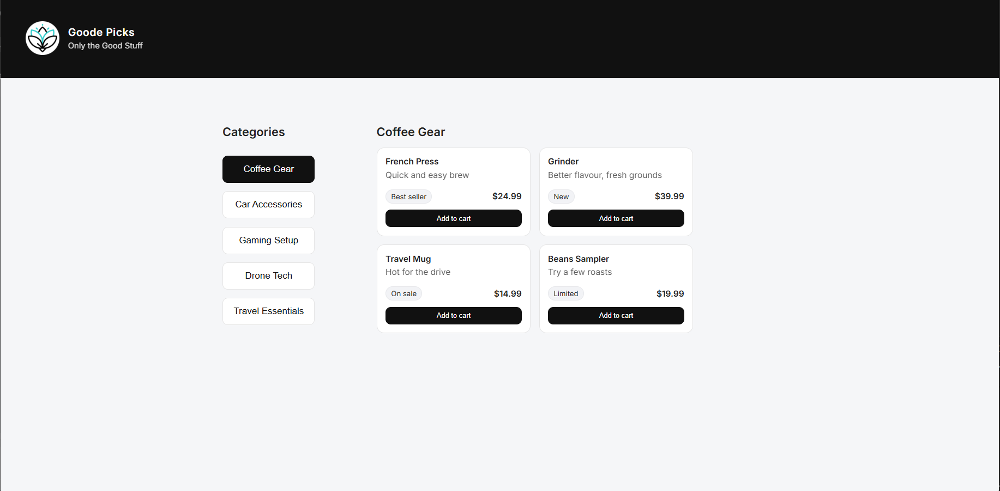

# Testing Document – Everyday Market React App

## Environment
- Framework: React (Vite)
- Browser: Chrome
- OS: Windows

---

## Commands Used

| Command | Purpose |
|--------|---------|
| `npm run dev` | Run development server |
| `npm run lint` | Check code quality with ESLint |
| `npm run build` | Verify production build succeeds |

---

## Test 1 – Categories Load

**Steps**
1. Open the app in the browser
2. Wait for categories to load

**Expected Result**
- "Loading categories..." appears for ~2 seconds
- Category list appears after delay

**Screenshot**

---

## Test 2 – Category Selection

**Steps**
1. Click a category button (e.g., Coffee Gear)

**Expected Result**
- Selected category highlights
- Console logs selected category name

**Screenshot**

---

## Test 3 – Preview Area Updates

**Steps**
1. Click different categories
2. Observe preview cards update

**Expected Result**
- Product preview cards change based on selected category

**Screenshot**

---

## Linting Check

**Command:** `npm run lint`  
**Result:** No errors or warnings

---

## Build Check

**Command:** `npm run build`  
**Result:** Build completed successfully without errors
